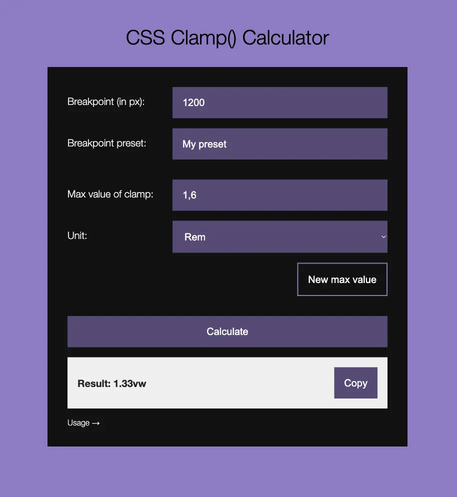

# CSS Clamp() Calculator

---

This tool helps you generate responsive CSS `clamp()` values with ease — no media queries, no guesswork.



It’s designed for modern workflows where you already know your min and max values and just want the dynamic part calculated quickly. Whether you're working with `padding`, `font-size`, or other fluid properties, this calculator gives you the precise `vw`-based value that scales smoothly between your defined limits.

Unlike many generators, this one assumes you prefer working directly in your IDE. Enter values, get the dynamic part, and paste it into your code — simple, clean, and fast.

This tool intentionally uses plain `vw` values, valuing simplicity over subpixel-perfect precision at breakpoints.

## Breakpoint
The width of the viewport where you want the max value to be applied.

## Max Value of Clamp
The maximum size, padding, margin, etc. This will be used to determine the value for the dynamic (vw) value of the clamp in relation to the breakpoint.

Please select the appropriate unit.

## Min Value of Clamp
This calculation does not take into account any minimum values for the clamp.

## New Max Value
Remove the previously entered max value and immediately start typing/pasting your new max value. The result will be automatically updated as you type. (Whenever in doubt, press the button that says "Calculate".)

## Result
The calculated dynamic mid-value of the clamp in vw. The MINVALUE and MAXVALUE should be defined statically in px/rem.

```
padding: clamp(MINVALUE, RESULT, MAXVALUE);
```

## Copy Button
Copies just what you need to quickly paste the dynamic value into your IDE of choice.

## Rem Units
Assumes the value of rem is set to be 10% of the px size.

```
html {
  font-size: 62.5%;
  position: relative;
}

body {
  font-size: 1.6rem;
}
```

## Local Storage
This clamp generator/calculator utilises local storage to store the Breakpoint and Unit.

## Presets
Presets can be stored to local storage, and loaded or removed from it.

## About This Tool
The designer provides designs for desktop and mobile devices only. That is fine these days. Just use CSS clamp to scale the items to fit the various screen sizes. Gone are the numerous @media queries at seemingly random places.

This generator/calculator is as simplified as possible. Ease of use and good workflow are of essence. It assumes you already have the max and min values in place and want to get the dynamic value from the max value to smoothly scale the content.

The idea is to build clamps in the IDE of choice rather than pasting each value to get a full line of CSS from this tool. It could be argued that it is quicker to use a keyboard to enter values than copy-pasting multiple values into fields.

The tool is built with 100% vanilla HTML, CSS, and JS — no frameworks, no dependencies. It's fully static and easy to modify or extend using any preprocessor or frontend stack you prefer.

## General and simple css clamp() demo

Check out how css clamp() works at this codepen:
https://codepen.io/Oscar-Hallberg/pen/qEBoawz


## Public Version

A fully featured, fast, and completely free version of this tool is available at:
https://clamp.hpns.dev/

No signups, no bloat, no data scraped — just a focused tool that does one thing well.
